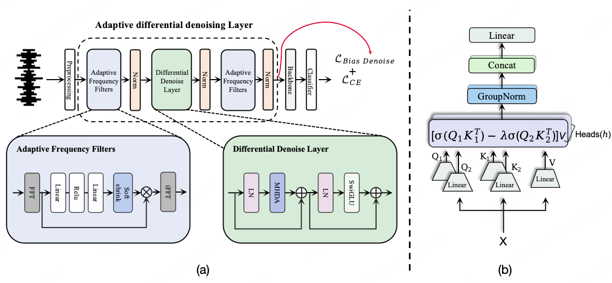

# Adaptive Differential Denoising for Respiratory Sounds Classification(Interspeech 2025)
This repo contains the code and models for our paper: 

Dong Gaoyang, Zhang Zhicheng, Sun Ping and Zhang Minghui, "Adaptive Differential Denoising for Respiratory Sounds Classification", and **accepted at Interspeech 2025**. 📑 <a href="https://arxiv.org/pdf/2506.02505">Paper</a>


## Overview
Automated respiratory sound classification faces practical challenges from background noise and insufficient denoising in existing systems. We propose **A**daptive **D**ifferential **D**enoising network for **R**espiratory **S**ounds **C**lassification (**ADD4RSC**), that integrates noise suppression and pathological feature preservation via three innovations: 1) **Adaptive Frequency Filter** with learnable spectral masks and soft shrink to eliminate noise while retaining diagnostic high-frequency components; 2) A **Differential Denoise Layer** using differential attention to reduce noise-induced variations through augmented sample comparisons; 3) A **bias denoising loss** jointly optimizing classification and robustness without clean labels. Experiments on the ICBHI2017 dataset show that our method achieves `65.53%` of the Score, which is improved by `1.99%` over the previous sota method.

<p align="center">
  
</p>


## 🚀 Getting Started

### 1. 📦 Download and prepare audio data
- **Download**: ICBHI 2017 Respiratory Sound Database [Official Challenge Page](https://bhichallenge.med.auth.gr/ICBHI_2017_Challenge), set Path: After downloading and extracting the dataset, set the path to the data folder using the --data_folder argument. For example:```args.audioset_ckpt = './data/ICBHI/ICBHI_final_database'```
- **Characteristics**:
  - 126 subjects with real-world recordings
  - Contains heart sounds, ambient noise, and transducer artifacts
  - Sampling rates: 4kHz-44.1kHz → resampled to 16kHz


### 2. 🤖 Download pre-trained model
You can download the pretrained AST model from [Hugging Face](https://huggingface.co/MIT/ast-finetuned-audioset-10-10-0.4593).
After downloading, you can set the path to the checkpoint file by assigning it to args.audioset_ckpt. For example:```args.audioset_ckpt = '/path/to/ast-finetuned-audioset-10-10-0.4593.pth'```


### 3. 🧠 Start Training

Our code is implemented in **PyTorch**. Please install the required packages listed in the `requirements.txt` file. The versions we use are shown below for reference, though other versions may also work:```torch==2.0.1,torchaudio==2.0.1,cuda==11.7```


The training script supports argument-based configuration. You can modify the parameters of the **Adaptive Differential Denoising (ADD)** layer via command-line arguments，such `--denoise_d_model`,`--denoise_num_heads` and `loss_beta`. The backbone model can also be specified using the `--model` argument.

To start training, simply run: ```python main.py```


### 4. 📊 Comparison of Our Method with State-of-the-Art on the ICBHI Dataset
  **Comparison of CNN-based Methods on the ICBHI Dataset**
  | CNN Model                    | $S_p$(%) | $S_e$(%) | Score(%) | Publication    |
  |-----------------------------|----------|----------|----------|----------------|
  | LungRN+NL              | 63.20    | 41.32    | 52.26    | BioCAS 2019    |
  | RespireNet               | 72.30    | 40.10    | 56.20    | EMBC 2021      |
  | Wang *et al.*  (Splice)  | 70.40    | 40.20    | 55.30    | ICASSP 2022    |
  | StochNorm               | 78.86    | 36.40    | 57.63    | IEEE TBE       |
  | CoTuning                | 79.34    | 37.24    | 58.29    | IEEE TBE       |
  | Chang *et al.*          | 69.92    | 35.85    | 52.89    | Interspeech 2022|
  | SCL                    | 75.95    | 39.15    | 57.55    | WASPAA 2023          |
  | **Ours (ResNet50)**         | **83.76**| **34.18**| **58.97**| **Interspeech 2025**    |

  **Comparison of Transformer-based Methods on the ICBHI Dataset**
  | Transformer Model           | $S_p$(%) | $S_e$(%) | Score(%) | Publication    |
  |-----------------------------|----------|----------|----------|----------------|
  | AFT on Mixed-500         | 80.72    | 42.86    | 61.79    | NeurIPS Workshop 2023          |
  | AST Fine-tuning          | 77.14    | 41.97    | 59.55    | nterspeech 2023   |
  | Patch-Mix CL             | 81.66    | 43.07    | 62.37    | Interspeech 2023   |
  | M2D                    | 81.51    | 45.08    | 63.29    | TASLP  |
  | DAT                     | 77.11    | 42.50    | 59.81    | ICASSP 2024          |
  | SG-SCL                   | 79.87    | 43.55    | 61.71    | ICASSP 2024          |
  | RepAugment               | 82.47    | 40.55    | 61.51    | EMBC 2024          |
  | BTS                    | 81.40    | 45.67    | 63.54    | Interspeech 2024|
  | MVST                   | 80.60    | 44.39    | 62.50    | ICASSP 2024    |
  | LungAdapter            | 80.43    | 44.37    | 62.40    | Interspeech 2024|
  | CycleGuardian           | 82.06    | 44.47    | 63.26    | Complex&Intelligent System  |
  | **Ours (AST)**              | **85.13**| **45.94**| **65.53**| **Interspeech 2025**   |


## 📚 Citation

Please cite related papers if you use ADD4RSC.

```
@article{dong2025adaptive,
  title={Adaptive Differential Denoising for Respiratory Sounds Classification},
  author={Dong, Gaoyang and Zhang, Zhicheng and Sun, Ping and Zhang, Minghui},
  journal={arXiv preprint arXiv:2506.02505},
  year={2025}
}
```

## 🙏 Acknowledgments

We would like to thank the following contributors and communities:

- The [patch-mix_contrastive_learning](https://github.com/raymin0223/patch-mix_contrastive_learning) repository for related code and inspiration.
- The [FunASR community](https://github.com/alibaba-damo-academy/FunASR) for their open-source contributions and support.
- The [Adaptive frequency filters as efficient global token mixers](https://github.com/sunpro108/AdaptiveFrequencyFilters) repository for related code and inspiration.

Their work and codebases provided valuable foundations for our implementation.

